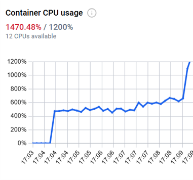
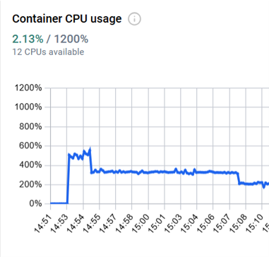
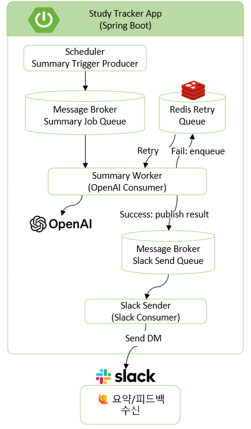

Kafka 기반 Event Driven Architecture로
Scheduler 병목 문제를 해결한 Slack 기반 학습 트래킹 서비스

# Study Tracker 2.0
※ 기존 1.0 프로젝트의 아키텍처 개선 버전으로, 구조 변경을 명확히 보여주기 위해 별도 repository로 분리함

Study Tracker 2.0은 Slack 기반 학습 기록 서비스로,
Scheduler 중심의 동기 처리 구조에서 발생하던 병목 문제를 해결하기 위해
Kafka 기반 Event Driven Architecture로 리디자인함

- Slack 메시지로 학습 기록
- OpenAI를 통해 요약/피드백 생성
- Slack DM으로 자동 전달
- Kafka 기반 Worker 아키텍처로 비동기 처리

### Performance Test (k6)
##### 테스트 목적

Scheduler 기반 구조에서 발생하던 병목 문제가
Kafka 기반 Event Driven Architecture에서 어떻게 개선되는지 검증

##### 테스트 환경
- Local (Docker Compose)
- Kafka + PostgreSQL + Redis 구성
- OpenAI API Mock 처리
- k6 기반 부하 테스트

※ Kafka 기반 구조의 효과를 검증하기 위해 Scheduler와 이벤트가 동시에 발생하는 시나리오(SC3, SC5)에 집중

#### 📌 SC3: Event + Scheduler
> 지속적인 사용자 요청과 Scheduler가 동시에 실행되는 상황에서
> 병목 발생 여부를 검증하기 위한 시나리오

- p95 latency: 346ms
- TPS: ~340 req/s
- 에러율: 0%

👉 Scheduler 동시 실행 상황에서도 병목 없이 안정적 처리

#### 📌 SC5: Event Burst + Scheduler
> 트래픽이 순간적으로 증가하는 상황에서
> 이벤트 기반 구조가 부하를 어떻게 흡수하는지 검증하기 위한 시나리오

- p95 latency: 530ms
- TPS: ~825 req/s
- 에러율: 0%

👉 부하 상황에서도 장애 없이 "지연으로 부하를 흡수"하는 구조 확인

##### 📊 Resource Usage (CPU)

<p align="center">
  
  
</p>
<p align="center">
  SC3 (좌) vs SC5 (우)
</p>

- CPU는 부하 증가에 따라 점진적으로 상승하며 안정적으로 유지됨
- Event burst 상황(SC5)에서도 급격한 스파이크 없이 처리 가능
- 시스템이 중단되지 않고 부하를 흡수하는 구조임을 확인


##### 핵심 결과
| 항목 | 결과 |
|------|-----|
| 안정성 | 에러율 0% 유지 |
| 확장성 | 최대 ~800 TPS 처리 |
| latency | 병목 없이 안정적으로 유지 |
| 구조 개선 | 요청 처리와 작업 처리 분리 성공 |


##### 결론

Kafka 기반 Event Driven Architecture로 전환하여  
요청 처리와 작업 처리를 분리하고,

👉 부하 상황에서도 장애 없이 "지연으로 부하를 흡수"하는 구조로 개선하였다.


### 1.0에서 발견된 문제

- Scheduler 중심 순차 처리로 인한 처리 지연 및 병목 발생
- 외부 API(OpenAI, Slack) 호출이 포함된 동기 흐름으로 인해
  latency가 전체 처리 시간으로 확장
- WebClient 재시도 폭주로 인한 커넥션 리소스 고갈

### 기존 구조

```js
Scheduler
↓
DB 조회
↓
OpenAI 호출
↓
Slack 전송
```

### 2.0 아키텍처



2.0에서는 Kafka 기반 이벤트 흐름으로 구조를 변경
Scheduler는 작업을 직접 수행하지 않고,
요약 요청 이벤트를 Kafka로 발행하는 역할만 수행

### 핵심 개선점

| 항목 | 1.0 | 2.0 |
|------|-----|-----|
| 처리 방식 | Scheduler 중심 | Event Driven |
| OpenAI 호출 | Scheduler | Worker |
| Slack 전송 | Scheduler | Worker |
| 메시징 | 없음 | Kafka |
| 재시도 | Redis queue | Redis queue |

### 설계 포인트

- Kafka 기반 비동기 처리로 요청/작업 분리
- Worker 단위 분리로 장애 격리
- 외부 API latency 영향 최소화
- 이벤트 단위 병렬 처리 구조

### 기술 스택
- Language: Java 21
- Framework: Spring Boot 3
- Messaging: Kafka
- Database: PostgreSQL
- Retry: Redis
- External API: Slack API, OpenAI API

### Retry 전략

- 요약 생성 실패 시 Redis 기반 retry queue를 사용
- 최대 재시도 횟수 제한
- 일정 시간 간격으로 재시도 수행
- 최소 1회 이상 처리(at-least-once)


### 관련 문서
- [Study Tracker 1.0 Repository](https://github.com/jia8883/study-tracker)
- [Study Tracker 2.0 아키텍처 리디자인](./reports/study_tracker_2.0_redesign.pdf)


